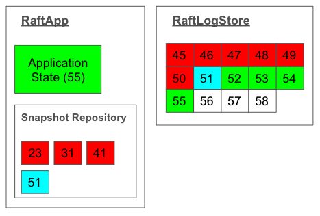

# Application State

In RaftCore, `RaftApp` and `RaftLogStore` are especially important because
these two compose the application state.
This section explains the conceptual aspect of it.

## RaftApp

`RaftApp` is an abstraction that represents the FSM (Finite State Machine) of the application
and the snapshot repository.
The snapshot repository isn't separated because the contents of the snapshot is 
strongly coupled with the application state.

The application state can be updated by applying the log entries.
In this figure, the last applied entry is of index 55.

`RaftApp` can generate a snapshot arbitrarily to compact the log.
When `RaftApp` makes a snapshot and stores it in the snapshot repository.
The latest snapshot is immediately picked up by the Raft process and it 
manipulates the log (right in the figure) by replacing the snapshot entry.
In this figure, the snapshot index is 51.

Old snapshots will be garbage collected.

Snapshots may be fetched from other nodes.
This happens when the Raft process is far behind the leader and
the leader doesn't have the log entries as they are garbage collected.

## RaftLogStore

`RaftLogStore` is an abstraction that represents the log entries.
In the figure, log entries from 45 to 50 are scheduled for garbage collection.
snapshot entry is of index 51 and it is guaranteed that the corresponding snapshot
exists in the snapshot repository. 52 to 55 are applied.
56 or later are not applied yet. They are either uncommitted or committed.