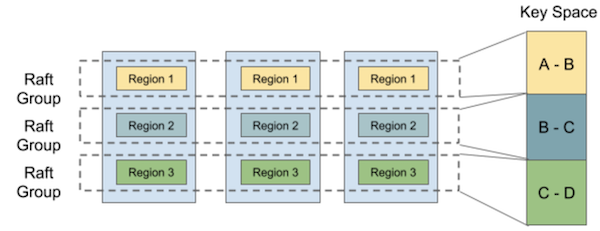

# Multi-Raft

[Raft](https://raft.github.io/) consensus algorithm is nowadays a widely used building block of distributed applications.
The algorithm is about consensus on the sequence of log entries, which are applied to a state machine.
When the two log entries are identical, then the resulting state is identical too.
In this sense, it is also called **replicated state machine**.

The typical usage of the Raft algorithm is to implement a distributed key-value store.
However, naive implementation will suffer from scalability issues due to the seriality of the algorithm.
Let's consider putting (k1,v1) and (k2,v2) in the data store, naive implementation can't handle these two concurrently
because the operations are serialized.

Sharding is a common solution to this kind of problem.
If the k1 and k2 are enough distant in the key space, then the operations can be handled concurrently
by sharded Raft clusters.
Since we can split the single Raft cluster into multiple small Raft clusters,
it naturally addresses the capacity scalability problem at the same time.
TiKV uses this technique ([ref](https://tikv.org/deep-dive/scalability/multi-raft/)).

There are two ways of implementing a multi-raft.
One is deploying multiple Raft clusters independently.
One of the problems of this approach is that resources like IP addresses or ports must be
allocated per node to identify them.
This introduces unnecessary complexity in deployment.
Another problem is that shards can't share the resources efficiently.
In the implementation of a key-value store, the embedded datastore should be shared among the shards
for efficient I/O like write batching.
For these problems, I will take the second approach.

lolraft implements **in-process multi-raft**.
As the name implies, lolraft allows you to place multiple **Raft processes** in a single gRPC server process.
These Raft processes can form a Raft cluster on independent **shards**.

